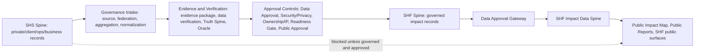

# SHS Spine Formalization & SHS-to-SHF Data Flow Audit V1

## Executive Summary

SHS Spine is the operational, private, client, and business data spine. It is the upstream source for ClientOps, Production Ops, Sales Ops, Website Studio, WebMaker, BuilderHub, Reports workflow, maintenance, support tickets, service delivery, QA, project handoffs, upgrades, and SHS business activity.

SHF Spine is the nonprofit/foundation impact spine. It receives only eligible, governed, approved impact data after the applicable governance, verification, privacy, ownership, readiness, public approval, and Data Approval Gateway controls.

V1 formalizes that SHS Spine is not secondary and must not be collapsed into SHF Spine. SHF Spine does not own raw SHS operational/client data, and SHS private data cannot enter SHF public surfaces unless it is governed, approved, and public-safe.

## SHS Spine Definition

SHS Spine is the operational truth source for SHS business activity. It owns internal and client-facing work-in-progress records, including:

- ClientOps records.
- Production Ops records.
- Sales Ops records.
- Website Studio and BuilderHub activity.
- Public WebMaker product activity where it remains SHS product context.
- Reports workflow records.
- Maintenance and support tickets.
- Service delivery activity.
- Project handoffs.
- Internal QA notes.
- Upgrade opportunities.
- Internal business system outputs.

SHS Spine may feed the governance/data pipeline only through approved boundaries. It does not public-approve data, write SHF Impact Data Spine, or publish public SHF reports.

## SHF Spine Definition

SHF Spine is the nonprofit/foundation impact spine. It owns public-impact records only after governance approval, such as:

- Approved aggregate impact counts.
- Approved county impact metrics.
- Approved program outcomes.
- Approved workforce, youth, and education outcome records.
- Approved public stories.
- Approved non-sensitive service categories.
- Approved public report metadata.
- Approved public map records.

SHF Spine does not own raw SHS client/private data, internal SHS business notes, unverified operational data, support details, billing/payment support state, or any record blocked by privacy, ownership, security, or approval controls.

## SHS-to-SHF Data-Flow Doctrine

SHS Spine may feed SHF Spine only when:

- The source is registered or eligible.
- Federation, aggregation, normalization, evidence, and verification checks are satisfied where applicable.
- Truth Spine, Oracle, Data Approval, and Public Approval requirements are satisfied where applicable.
- Security / Privacy review does not block exposure.
- Data Ownership / IP does not block use.
- Readiness Gate allows movement.
- Data Approval Gateway or human approval occurs before public use.
- The record is explicitly public-approved before entering public SHF impact surfaces.

## What Must Stay In SHS

- Client private data.
- Internal business data.
- Support tickets.
- Maintenance details.
- Billing/payment support status.
- Private operational notes.
- Private QA notes.
- Internal sales notes.
- Client-specific business metrics unless approved.
- Raw form submissions.
- Unverified operational data.
- PII or sensitive data.
- Anything with security, privacy, ownership, consent, or licensing blockers.

## What Can Cross To SHF

- Approved aggregate impact counts.
- Approved county impact metrics.
- Approved program outcomes.
- Approved workforce outcome records.
- Approved youth/education outcome records.
- Approved public stories.
- Approved non-sensitive service categories.
- Approved public report metadata.
- Approved public map records.

Crossing does not mean public publication by itself. Public SHF use still requires the applicable approval and gateway controls.

## Existing Evidence Found

### SHS OS / SHF OS Rule

- `src/data/shfImpactData.js` states that SHS OS is the infrastructure and operations system and SHF OS is the foundation/community impact reporting system.
- `src/data/shfImpactData.js` states private SHS client data must never appear in SHF public map/report outputs.
- `src/data/shfImpactData.js` exports `SHF_DATA_FLOW_RULE`, which allows only SHF-approved mission/program data to flow into public SHF maps, reports, donor updates, grant reports, and board-facing summaries.

### SHF Impact Data Spine

- `src/data/shfImpactData.js` exposes `isPublicApprovedImpactRecord(record)`.
- `getPublicApprovedMapCounties()` filters counties through `isPublicApprovedImpactRecord`.
- `getProgramLaneById()` only returns a lane when it is public-approved.
- `getMapDataStatusSummary()` reports `visibilityRule: "Public-approved data only"`.
- `src/pages/shf-command/components/SHFImpactOhioMap.jsx` displays a visible SHF Data Spine status panel with public-approved record count, trust level, last updated, and visibility rule.

### SHS Internal Source Surfaces

- `src/pages/admin/ops/opsData.js` labels Production Ops as an internal SHS production workflow and says clients see approved demos/deliverables, not internal build packets, prompts, QA machinery, or adaptive learning.
- `src/router/AdminRoutes.jsx` protects `/ops/*`, `/builder`, `/web-maker`, `/studio/templates`, `/reports`, `/command`, `/dashboard`, Truth Spine, Oracle, AI Guardrails, Game Theory, Agent Fabric, and audit/governance routes behind admin identity and role gates.
- `src/system/identity/hubAccessControl.js` keeps internal Production Ops routes SHS-admin only.
- `src/components/admin/AdminSidebar.jsx` surfaces Production Ops, Reports, Website Studio, Command Center, Dashboard, Registry, Truth Spine, Oracle, AI Guardrails, Game Theory, and Agent Fabric as admin/control-center navigation.
- `src/pages/admin/BuilderHub.jsx` is the protected admin/internal Website Studio control surface.
- `src/pages/public/WebMakerPage.jsx` is the public-facing SHS WebMaker product surface, not SHF Impact Data Spine.

### Cross-App Identity And Route Bridge

- `src/system/routes/crossAppRouteBridge.js` defines SHRV1 governance/admin routes and SHF-Next public/internal route targets without putting secrets in URLs.
- SHF-Next `src/App.tsx` keeps `/studio/templates`, `/studio/templates/browse`, `/foundation`, `/foundation/impact-report`, `/solutions`, and `/` public.
- SHF-Next `src/App.tsx` wraps `/ops`, `/ops/clientops`, and `/foundation/data-approval` with `CrossAppAccessNotice`.
- SHF-Next `src/data/crossAppIdentityBridge.ts` classifies `/ops` as `INTERNAL_OPS`, `/ops/clientops` as `INTERNAL_CLIENTOPS`, `/foundation/data-approval` as `FOUNDATION_ADMIN`, and `/foundation/impact-report` as `PUBLIC_FOUNDATION`.
- SHF-Next `src/components/CrossAppAccessNotice.tsx` returns `null` for public routes and shows identity/role boundary context for non-public routes.

## SHS Internal Source Surfaces

The following surfaces are SHS Spine source surfaces and should feed SHF only through governance:

- SHRV1 Admin Production Ops: `/ops/production`, `/ops/projects`, `/ops/brand-profile`, `/ops/page-intent`, `/ops/layout-blueprint`, `/ops/visual-treatment`, `/ops/assets`, `/ops/data-binding`, `/ops/mock-review`, `/ops/build-packet`, `/ops/screenshot-qa`, `/ops/learning`.
- SHRV1 BuilderHub: `admin.html#/builder`, `admin.html#/web-maker`, `admin.html#/studio/templates`.
- SHRV1 Reports/admin workflow: `admin.html#/reports`, `admin.html#/reporting`, `admin.html#/command`, `admin.html#/dashboard`.
- SHF-Next Ops: `/ops`, `/ops/command`, `/ops/projects`, `/ops/library`, `/ops/qa`, `/ops/sales`, `/ops/clientops`.

These are operational and/or internal workflow surfaces. They must not directly publish SHF public impact data.

## SHF Public/Impact Surfaces

The following are SHF public/impact-facing surfaces and must consume only governed/public-safe data:

- SHRV1 SHF Impact Command Center and Public Impact Map display SHF Impact Data Spine status and public-approved record counts.
- SHF-Next `/foundation`.
- SHF-Next `/foundation/impact-report`.
- SHF-Next `/foundation/impact-report/print`.
- SHF-Next `/foundation/report`.
- SHF-Next `/foundation/data-approval` is gateway-adjacent and not public in the identity bridge.

## Cross-App Identity/Route Bridge Relationship

SHRV1 remains the governance/admin authority for Truth Spine, Oracle, AI Guardrails, Game Theory, Agent Fabric, Reports, Registry, and admin control surfaces. SHF-Next consumes route and identity boundary metadata for public foundation reporting, data approval, internal ops, ClientOps, and public Website Studio browsing.

The bridge supports separation by classifying public routes separately from internal ops/foundation-admin routes. It also documents cross-app links from ClientOps to SHRV1 governance/Reports and from SHF Data Approval to SHRV1 Truth Spine.

## Relationship To Truth Spine

Truth Spine may evaluate claims/evidence coming from SHS Spine, but it does not make SHS private data public. SHS-origin data remains private unless it passes source, evidence, verification, privacy, ownership, readiness, public approval, and gateway controls.

## Relationship To Adapter Layer

Adapter Layer is the first formal preparation boundary for SHS Spine outputs before Source Registry, Data Federation, or Data Aggregator intake. It may classify source system, input format, mapping readiness, provenance completeness, and target intake layer. SHS operational/private data remains private unless downstream governance allows transfer.

## Relationship To Batch / Import Layer

Batch / Import Layer governs bulk SHS Spine exports, ClientOps exports, Website Studio exports, partner datasets, CSV/JSON uploads, and import batches before they reach Adapter Layer or Source Registry. SHS private operational data remains private unless downstream governance allows transfer.

## Relationship To Warehouse Sync Layer

Warehouse Sync Layer prepares governed SHS/SHF records for future analytics or warehouse sync. It does not write warehouse records in V1 and does not make SHS private data public.

## Relationship To Production Automation Layer

Production Automation may evaluate automation readiness for SHS operational workflows, ClientOps, imports, syncs, reports, and maintenance actions, but it does not execute automation in V1 and cannot move SHS private data into SHF public surfaces without downstream governance.

## Relationship To Notification / Alert Layer

Notification / Alert Layer may evaluate notification readiness for SHS operational workflows, ClientOps, imports, syncs, reports, readiness blockers, and Watchtower findings, but it does not send notifications in V1 and cannot move SHS private data into SHF public surfaces without downstream governance.

## Relationship To Data Approval Gateway

Data Approval Gateway is the human/review gate before public SHF use. It does not own raw SHS operational data, and SHS records cannot bypass it into public SHF Impact Data Spine.

## Relationship To SHF Impact Data Spine

SHF Impact Data Spine remains the public impact data contract. It filters public-approved records and exposes only public-safe impact data. This task did not mutate `src/data/shfImpactData.js` because the existing file already states the SHS OS / SHF OS separation and public-approved filtering rule.

## Registry Updates

Updated `docs/MASTER_LAYER_REGISTRY.md` to formalize:

- SHS Spine.
- SHF Spine.
- SHS→SHF Data Flow Boundary.

## Guardrail Updates

Updated `docs/TRUTH_SPINE_GUARDRAILS.md` with SHS Spine / SHF Spine boundary rules:

- Truth Spine may evaluate eligible SHS-origin claims/evidence.
- Truth Spine does not make SHS private/client/internal data public.
- Public SHF use requires approval layers and Data Approval Gateway.
- Private SHS records remain in SHS unless governed, safe, and public-approved.

## Config Scaffold

Created `src/system/spines/shsSpine.js` as an advisory-only config scaffold. It exports:

- `SHS_SPINE_DEFINITION`
- `SHF_SPINE_DEFINITION`
- `SHS_TO_SHF_DATA_FLOW_RULES`
- `SHS_PRIVATE_DATA_CATEGORIES`
- `SHS_TO_SHF_ALLOWED_PUBLIC_CATEGORIES`
- `isShsPrivateOperationalCategory(category)`
- `isEligibleForShfSpineTransfer(record)`
- `getShsToShfTransferWarnings(record)`

The scaffold does not set `publicApproved`, does not mutate SHF Impact Data Spine, does not create data, and does not publish reports.

## Validation Results

Passed:

- `npm run check:governance`
- `npm run build`
- `python3 scripts/check_master_layer_registry.py`
- `python3 scripts/check_truth_spine_freeze.py`
- `python3 scripts/check_duplicate_layer_cleanup.py`

## Files Changed

- `docs/MASTER_LAYER_REGISTRY.md`
- `docs/TRUTH_SPINE_GUARDRAILS.md`
- `docs/SHS_SPINE_FORMALIZATION_V1.md`
- `docs/SHS_SPINE_FORMALIZATION_V1.json`
- `src/system/spines/shsSpine.js`

## Remaining Risks

- The SHS Spine scaffold is advisory-only and is not yet wired into runtime ingestion.
- Future SHS-to-SHF transfers need explicit implementation at the Source Registry / Data Aggregator / Data Approval Gateway boundaries.
- SHF-Next remains a separate repo; this audit inspected it but did not modify it.
- Existing API Gateway/Event Webhook working-tree changes remain separate and were not staged or committed by this task.

## V1 Complete

Yes.
