# Silicon Heartland Systemwide Workflow Dependency Graph

Audit baseline: 2026-09-09. This graph describes execution dependencies, not merely conceptual relationships. An upstream node is a prerequisite when its persisted, authorized result is required by a downstream workflow.

## Dependency Graph

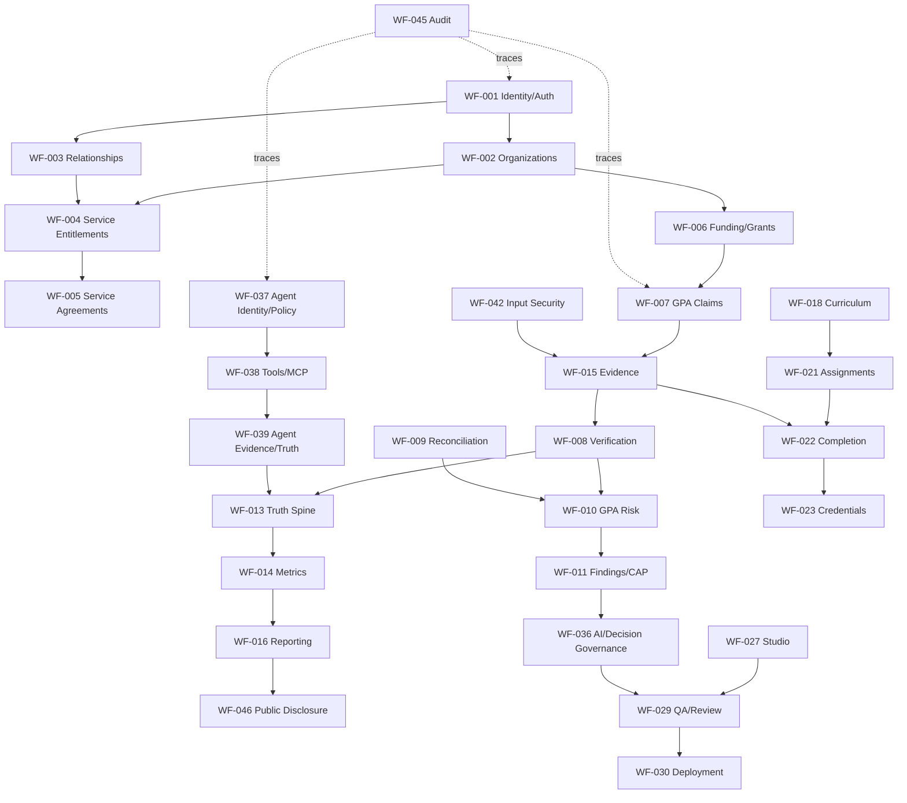

## Remediation Order

1. **P0:** Identity/scope, Truth/Evidence/Metric boundaries, public disclosure, AI/human authority, Agent Fabric signed ingress/tool controls, and audit coverage.
2. **P1:** Organization onboarding and entitlements, funding-to-assurance, curriculum/completion/evidence, Studio QA/review, trusted reporting outbox, source ingestion, and Agent workflow terminal states.
3. **P2:** Career, calendar, live learning, impact attribution, and secondary consumer/API completion.
4. **P3:** UI stale/error states, chunk-size warnings, and operational polish.

## Blocking Relationships

| Blocker | Blocks | Why |
|---|---|---|
| Identity/org scope | Every tenant-scoped workflow | Creation, retrieval, mutation, and derived projections require a canonical scope |
| Evidence/Truth boundary | GPA, reporting, metrics, credentials, public disclosure | Institutional claims must not bypass admissibility and verification |
| Agent authority/runtime | Agent workflows and AI-integrated consumers | No consequential AI action can be accepted without signed, scoped, approved execution |
| Public disclosure boundary | CivicSure public explorer and reports | Internal risk/evidence/adverse details must not leak |
| Funding/service handoff | GPA and impact attribution | Financially grounded assurance needs canonical obligation/service references |
| Event/outbox terminal handling | Reporting, ingestion, projection workers | A producer without idempotent consumer/retry/failure proof is not complete |

## Stage B Acceptance Gates

Each remediation must demonstrate: canonical service call, authorized scope, durable persistence, valid transition, downstream consumer result, failure/terminal behavior, history/audit, and a fresh acceptance artifact. Documentation-only or route-only changes do not close a node.

## SYS-0A Execution Program and Azure Lock

1. SYS-1 Institutional Integrity: identity/scope, Truth/Evidence, public disclosure, consequential authority, and security-sensitive gaps.
2. SYS-2 Shared Platform: identity, organizations, membership, relationships, onboarding, entitlements, and shared events/outbox.
3. SYS-3 Funding/Grants/Evidence/Reporting: obligation, delivery, evidence, metrics, reporting, and public handoffs.
4. SYS-4 Curriculum/Career/Student: enrollment, assignments, learning, completion, credentials, portfolio, career, calendar, and live learning.
5. SYS-5 Studio/Builder/QA/Review/Release: workspace, build, QA, review, packet, deployment, and recovery.
6. SYS-6 Agent Fabric Production Workflows: sessions, delegation, MCP/tools, approvals, durable workforce, recovery, evidence, audit, and revocation; only after safety/architecture approval.
7. SYS-7 Storage/External Integrations: repository-local storage contracts first, then Azure acceptance only after a subscription exists.
8. SYS-8 Final Systemwide Acceptance: API, PostgreSQL, UI, isolation, events, performance, failure/recovery, and broad regression.

No Azure adapter or subscription-backed workflow was discovered. Do not classify a workflow as Azure-blocked until repository-local interface, provider-neutral contract, local/test implementation, metadata/provenance, scope, authorization, audit, retry, retention hooks, secrets boundary, and observability are complete.

## SYS-1A Integrity Rebaseline — 2026-09-09

The following current dependency edges were exercised and passed their scoped
integrity gates:

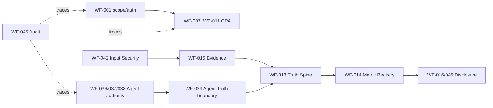

Scope and permission guards fail closed; inadmissible or insufficiently
provenanced Evidence cannot support the exercised institutional outcomes; GPA
failed verification cannot promote Truth; metrics resolve through the
platform registry; public GPA output is sanitized and unpublished by default;
and Agent Fabric consequential restrictions pass while production execution
remains disabled by policy. Later SYS waves retain the broader lifecycle and
consumer acceptance gates.

## SYS-1A Closure Gate

SYS-1A closes the scoped P0 integrity gate when the above controls pass and no
P0 product defect remains. It does not close SYS-2 through SYS-8 lifecycle,
consumer, UI, event, or performance work. The next dependency is SYS-2A,
which consumes canonical scope controls without enabling WF-040 production
execution.

## SYS-2A Evidence Rebaseline — 2026-09-09

`WF-001` now includes a persisted, scoped membership assignment/revocation
surface over the existing identity tables. `WF-002` → `WF-003` → `WF-004` →
`WF-005`, together with `WF-031`, has fresh PostgreSQL evidence for onboarding,
relationship, entitlement, agreement, suspension, revocation, and downstream
authorization guards.

`WF-032`/`WF-033` external-account and calendar recovery, `WF-034` live-learning
handoff, `WF-035` notification terminal delivery, and `WF-043` operations
consumer handoff are closed by SYS-2B real PostgreSQL/API evidence. Their
remaining dependency is regression only. WF-040 remains intentionally blocked
by the Agent Fabric V1 safety policy; no SYS-2 workflow may enable production
execution to close it.

## SYS-2B Consumer and Recovery Closure — 2026-09-09

The five remaining SYS-2 consumer/recovery workflows now have fresh evidence:
external calendar OAuth/mirror recovery, bounded calendar projection failure
semantics, live-learning cohort/API and attendance outbox handoff, durable
notification projection/read terminal state, and operational awareness
brief/outbox persistence. The real PostgreSQL consumer regression passed 2/2;
the domain suites passed with the API on port 8091. SYS-2 is complete except
WF-040's explicit safety-policy block. The next dependency is SYS-3A.

## Stage B Evidence Update — 2026-09-09

## SYS-3A4 Dependency Update — 2026-09-09

The funding branch now has a live repository-local authorization boundary:

`grant state + program allocation + effective date -> authorizeFundedUse -> claim/evidence consumer`.

Its prerequisites are scoped organization context and an `ACTIVE` grant; its
terminal denials cover wrong program, out-of-period, suspended, and closed
funding. Reporting now includes:

`approved report -> human correction -> immutable revision -> review -> approval`.

Rejected reports can be corrected and resubmitted without overwriting prior
revisions. SYS-3A5 still owns integrated authenticated API, browser,
final-consumer, and public current-version acceptance.

## SYS-3A3 Dependency Update — 2026-09-09

WF-006 → WF-016 → WF-017 now includes report review persistence and
operator-scoped quarantine recovery. Remaining dependency chain:

`funding-use authorization → verified report → human review → publication →
actual consumer → delivery recovery → public/current-version confirmation`.

SYS-4 remains blocked on SYS-3 terminal acceptance.

## SYS-3A4B Lifecycle Closure — 2026-09-09

The lifecycle dependency is now closed for repository-local funding and public
report versioning:

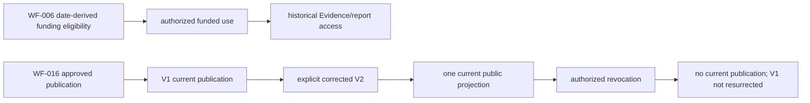

Fresh `shs_sys3a4b_20260909` PostgreSQL evidence covers the continuous funding
and report lifecycle tests. Migration 121 adds only scoped supersession/current
publication metadata and a one-current partial unique index. Funding expiration
remains date-derived; the service blocks resume after end date without inventing
an `EXPIRED` authority. SYS-3A5 remains the next dependency for integrated
authenticated HTTP, browser, and final-consumer acceptance; SYS-4 remains
blocked until that broader SYS-3 gate closes.

Closed evidence gates: disposable PostgreSQL integrity, API/Agent Fabric health, governance checks, focused Agent authority/Truth checks, CivicSure H-A2/H-B/H-C live workflows, public GPA fail-closed behavior, builds, UI contract validation, and diff hygiene. Open gates: broad cross-domain API regression, systemwide isolation, complete event-consumer/recovery proofs, material frontend-to-API workflows, and Agent Fabric production execution, which is intentionally disabled by policy.

## SYS-3A5 Acceptance Rebaseline — 2026-09-09

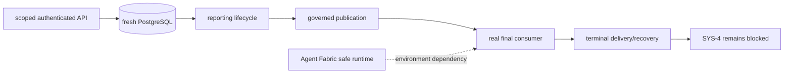

SYS-3A5 closed the focused API fixture seam but did not close the integrated
publication-to-consumer, reviewer/public browser, broad regression, or Agent
Fabric runtime gates. SYS-3 remains the active dependency; SYS-4 does not start.

## SYS-3A5B Acceptance Dependency Update — 2026-09-09

The Agent Fabric runtime dependency is resolved locally and the trusted
reporting handoff now has live signed-delivery evidence. WF-016 still depends
on determining/proving the active reviewer and public browser consumers and on
bounded application query-count measurement. WF-040 remains intentionally
blocked by safety policy. SYS-4 remains blocked.

## SYS-3A5C Final Acceptance Update — 2026-09-09

Trusted delivery now has a complete real-consumer dependency: dispatcher retry
classification -> quarantine -> scoped operator requeue -> isolated Agent
Fabric signed ingestion -> `DELIVERED` -> idempotent replay. The public
reporting API is the canonical public terminal consumer and review approval is
service/API-authorized; no mounted reviewer/public report browser dependency
exists. SYS-3 acceptance is complete; SYS-4 is the next phase. WF-040 remains
policy-blocked.

## SYS-4A Bounded Dependency Closure — 2026-09-10

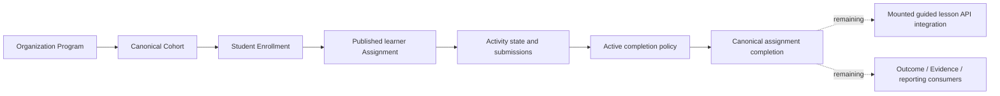

Fresh SYS-4A evidence closes the API-backed Program -> Cohort -> Enrollment -> Assignment -> Activity -> gated Completion dependency. The active guided lesson consumer remains the next blocker because `StudentUnit` still uses static/local progression. Portfolio, Career, Credential, institutional reporting, instructor/admin consumers, and broader accessibility/performance acceptance remain downstream SYS-4C/SYS-4D work.
## SYS-4B Guided Lesson Consumer Update — 2026-09-10

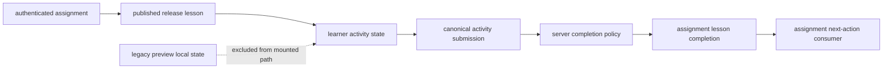

The mounted StudentUnit now follows this canonical path. Fresh browser and
disposable-database acceptance remains the closure gate; SYS-4C remains
downstream and has not started.

SYS-4B2 live evidence closes the mounted happy-path load/submission/completion
defect on the disposable stack. Negative, retry, isolation, durability, and
next-action consumer proof remain SYS-4B acceptance gates.

## SYS-4B3 Acceptance Closure — 2026-09-10

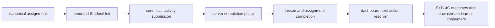

SYS-4B3 live-proved failure, retry, isolation, revocation, refresh, and
next-action behavior against fresh PostgreSQL and the real API/browser. WF-019
is complete for this dependency slice; SYS-4C remains downstream.

## SYS-4C downstream learner-result audit — 2026-09-10

The downstream edge remains open:
`lesson completion -> curriculum Outcome/Mastery -> Progress -> Portfolio /
Skill Profile -> Career result -> curriculum credential eligibility ->
learner-result reporting`. Existing domain-local consumers remain scoped and
valid, but no generic Outcome/Mastery/Progress persistence or cross-domain
consumer event exists. WF-022-WF-026 remain `PARTIAL`; no duplicate authority
was introduced.

## SYS-4C2 Learner-result foundation — 2026-09-10

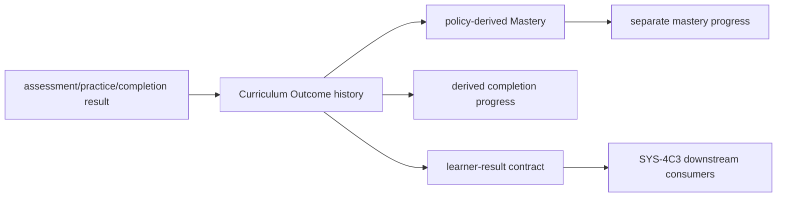

Fresh PostgreSQL acceptance proves failed and passing result history,
idempotent replay, current Outcome resolution, competency-linked Mastery, and
separate derived Progress. Existing Evidence, Truth, Metrics, Portfolio,
Career, Credentials, and Reporting authorities remain unchanged.

## SYS-4C3 consumer edge — 2026-09-10

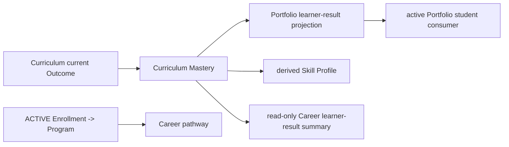

Portfolio remains the Portfolio authority and Career remains the pathway
authority. Skill Profile is a projection, not a new store. Credentials and
verified institutional Reporting remain downstream SYS-4C4 consumers.
## SYS-4C4 credential and metric edge — 2026-09-10

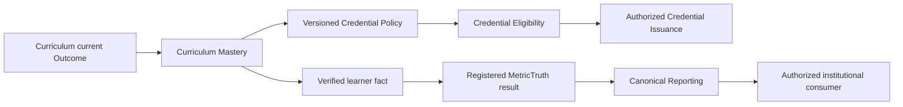

Migration 124 and the credential policy adapter are live-proven. The
MetricTruth and Reporting authorities remain canonical; the learner-result
fact-to-metric adapter and final institutional consumer are still open, so
WF-022/WF-023 remain `PARTIAL`.

## SYS-4C4B completion edge — 2026-09-10

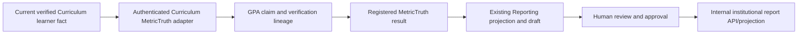

Fresh PostgreSQL acceptance proved this linked path, replay idempotency, and
fail-closed behavior when Curriculum verification became pending. Public
Disclosure is not part of this internal report workflow.

### SYS-4C4B final authenticated consumer acceptance — 2026-09-10

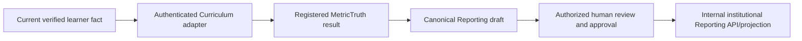

HTTP and PostgreSQL acceptance proved this chain plus wrong-program,
wrong-organization, and revoked-membership fail-closed behavior.

### SYS-4 remaining-workflow re-audit — 2026-09-10

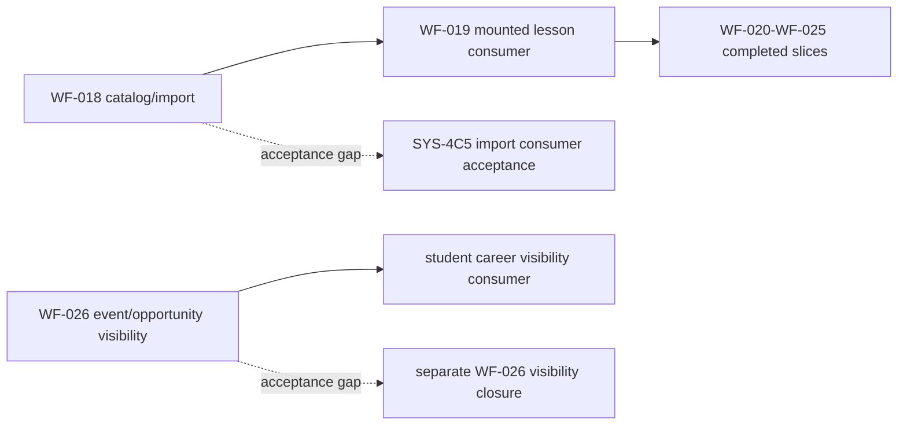

The re-audit finds no confirmed product gap in SYS-4. WF-018 and WF-026 are
the only repository-local open workflows, both classified as acceptance gaps.

### SYS-5B durable artifact foundation — 2026-09-10

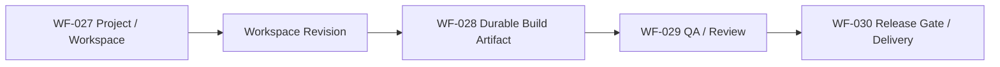

WF-028 is complete for the durable artifact authority and exact QA/Review
provenance. WF-027 is complete for the multi-user lifecycle/recovery contract;
WF-029 still requires its separate acceptance phase.
WF-030 now has a repository-local approval-gated TEST release request/attempt
lifecycle around the immutable artifact and existing deployment authority;
fresh authenticated HTTP authorization acceptance is complete. Production/provider
delivery is not claimed. WF-049 remains outside this phase
because its production Registry provider is unavailable.

## SYS-5D WF-027 acceptance closure - 2026-09-10

Fresh acceptance closed WF-027 for the canonical multi-user Studio lifecycle:
team-scoped project access, shared workspace persistence, revision conflict and
history protection, replay idempotency, restart reconstruction, lifecycle
transition denial, and removed-membership fail-closed behavior. WF-029 is the
next repository-local acceptance dependency; WF-049 remains external.
## WF-026 final Career visibility acceptance — 2026-09-10

WF-026 is `COMPLETE` for Career event/opportunity visibility. Fresh
`shs_wf026_20260910` PostgreSQL and authenticated API acceptance proved
organization/program eligibility, wrong-student and wrong-organization denial,
direct-ID protection, cancellation, date-based stale suppression, revoked
membership denial, and the shared Calendar projection. The mounted
`career.html#/calendar` surface displayed current backend-projected data and a
fresh browser context restored it. The only production correction was adding
student-tier opening/deadline and event end-time predicates; no new authority
or migration was introduced. All SYS-4 nodes WF-018 through WF-026 and shared
WF-033/WF-034 are complete. SYS-5 is next and was not started.

## SYS-5A Studio / Builder / QA / Review / Release rebaseline - 2026-09-10

The SYS-5 chain is `WF-027 project/workspace -> WF-028 build artifact ->
WF-029 QA/review/delivery -> WF-030 deployment/public release`, with WF-049
Registry submission branching from the Studio package. WF-027 and WF-029 have
repository-local contracts but require fresh end-to-end acceptance. WF-028 is
product-incomplete because no durable canonical build artifact is persisted.
WF-030 has an implemented and authenticated repository-local release foundation;
its `local_mock` TEST provider is not a production consumer. WF-049 is blocked at
the unavailable external production provider after local failure/retry
behavior. The next bounded phase is SYS-5B; no SYS-5B or SYS-6 work started.

## SYS-5E WF-029 acceptance closure - 2026-09-10

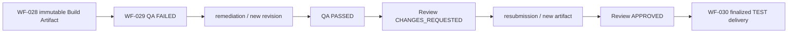

Fresh authenticated HTTP and mounted Builder/QA/Review acceptance closed
WF-029. Failed findings, revision-bound artifacts, review rejection and
resubmission, authorized approval, stale-lineage denial, and final delivery
were proven. WF-049 remains externally blocked; no WF-027, WF-049, or SYS-6
work started in this phase.

## SYS-6A Agent Fabric Rebaseline - 2026-09-10

SYS-6 currently contains WF-036, WF-037, WF-038, WF-039, WF-040, WF-041, and
WF-043. The control plane is substantially implemented, while the execution
plane is not a production workforce runtime. WF-037 and WF-038 remain
`PARTIAL — PRODUCT GAP`; WF-036, WF-039, and WF-041 remain
`PARTIAL — ACCEPTANCE GAP`; WF-043 remains COMPLETE. WF-040 remains
`BLOCKED — SAFETY/POLICY`, enforced by the global execution gate and the V1
simulation-only contract. SYS-6B is the next dependency-ranked phase for
durable identity/delegation/session/task foundation; no SYS-6B work started.

## SYS-6B durable identity/delegation/session/task foundation - 2026-09-10

Migration 128 and fresh authenticated HTTP acceptance close the bounded WF-037
foundation: durable scoped identity, delegation-linked sessions, bounded tasks,
CAS-protected pre-execution transitions, ordered attempts, cancellation, replay,
and scope/revocation denial. The existing global execution gate remains in
force. WF-038 remains a product gap for governed production tool/side-effect
execution; WF-036, WF-039, and WF-041 remain acceptance gaps; WF-040 remains a
safety/policy block. The next dependency-ranked phase is SYS-6C for governed
tools/MCP/resources/secrets/input-security boundaries; it was not started.

## SYS-6C Durable Governed Execution Foundation - 2026-09-10

WF-038 is COMPLETE for bounded governed execution coordination. Migration 129
adds scoped workers, atomic claims, leases, durable attempt history,
checkpointing, bounded retry, expiry recovery, cancellation and revocation
propagation. Authenticated HTTP and PostgreSQL acceptance passed, including
duplicate claim/replay protection and the disabled safe-execution gate.
WF-036, WF-039, and WF-041 remain acceptance work, while WF-040 remains
`BLOCKED — SAFETY/POLICY`. SYS-6D consequence-aware approval/incident/
revocation acceptance is next and is not started.

## SYS-6D Rebaseline - 2026-09-10

SYS-6D evidence confirms bounded execution remains complete for WF-038, while
WF-036 lacks generic durable task-level approval and exact action/approver
binding. WF-036 is `PARTIAL — PRODUCT GAP`; WF-039 and WF-041 remain
`PARTIAL — ACCEPTANCE GAP`; WF-040 remains `BLOCKED — SAFETY/POLICY`. The next
dependency-ranked phase is SYS-6E, Generic Agent Task Human Approval / Incident
Control Foundation. No next phase was started.

## SYS-6E Generic Agent Task Approval / Incident Control - 2026-09-10

WF-036 is COMPLETE for the generic durable approval envelope after migration
130 and authenticated API evidence. The envelope binds task/action/resource
context and does not replace owning-domain approval. WF-039 and WF-041 remain
acceptance-dependent; WF-040 remains safety blocked. SYS-6F Agent-to-Evidence /
Truth / Reporting Acceptance is next and was not started.

## SYS-6F Rebaseline - 2026-09-10

WF-039 is complete for the bounded Agent Attempt → Evidence → human Truth
acceptance path using existing authorities. WF-041 remains a separate MCP
cross-organization/resource/secret/replay acceptance gap, and WF-040 remains
safety/policy blocked. SYS-6G MCP acceptance is dependency-ranked next.

## SYS-6G MCP Acceptance - 2026-09-10

Fresh PostgreSQL/API evidence closes WF-041 for the bounded repository-local
MCP contract. The active path is `authenticated principal → scoped Agent
authority → MCP server/tool policy → canonical resource classification →
input-security scan → durable simulated invocation/outbox record`. Restricted
classification, unknown tool/server, raw-secret, wrong-org, and revoked
membership paths fail closed. Live external MCP delivery is not required for
this repository-local workflow and was not attempted. WF-040 remains
`BLOCKED — SAFETY/POLICY`; all other repository-local SYS-6 workflows are
complete. SYS-7 is the next wave and is not started.

## SYS-7A External Integrations / Storage / Provider Adapter Rebaseline - 2026-09-10

SYS-7 currently assigns WF-030, WF-032, and WF-049. WF-030 and WF-032 remain
complete for their current repository-local release and external-account
contracts. WF-049 has a canonical local Registry adapter with durable failure,
retry, and idempotency behavior, but remains `BLOCKED — EXTERNAL DEPENDENCY`
until the production Registry provider is available. No mandatory Azure-backed
SYS-7 workflow or repository-local storage authority gap was found. SYS-7B is
not started.

## SYS-8A Final Whole-System Integrated Acceptance - 2026-09-10

The current registry remains non-closed: 15 repository-local workflows are
still PARTIAL, including P0 authority, evidence, reporting, public disclosure,
audit, and cross-product handoff work. Fresh migration/schema and canonical
layer checks pass, but those workflow gaps prevent whole-system certification.
WF-040 remains safety/policy blocked and WF-049 remains externally blocked. A
bounded SYS-8B workflow-closure phase is recommended and was not started.

## SYS-8B0 Remaining Partial Workflow Closure Ledger - 2026-09-10

The current registry reconciles to 50 workflows: 33 COMPLETE, 15 PARTIAL,
WF-040 BLOCKED — SAFETY/POLICY, and WF-049 BLOCKED — EXTERNAL DEPENDENCY.
The 15 repository-local partials are WF-001, WF-006, WF-012, WF-013, WF-014,
WF-015, WF-016, WF-017, WF-042, WF-044, WF-045, WF-046, WF-047, WF-048, and
WF-050. WF-012 is the only confirmed product gap; the other 14 are acceptance
gaps. Roadmap status text for WF-006 and WF-019 was reconciled to the current
registry.

The finite dependency order is: (1) WF-012 public projection product seam;
(2) identity, evidence, Truth, input-security, legal-authority, audit, and
cross-product acceptance for WF-001, WF-013, WF-015, WF-042, WF-044, WF-045,
and WF-050; (3) funding, metrics, reporting, trusted outbox, impact, and source
ingestion acceptance for WF-006, WF-014, WF-016, WF-017, WF-047, and WF-048;
(4) final public-disclosure acceptance for WF-046; then final SYS-8
certification. No implementation phase was started by this ledger audit.

## SYS-8B1 WF-012 Closure - 2026-09-11

WF-012 is COMPLETE after the mounted public explorer/detail consumer was
connected to the canonical Reporting public projection. Fresh PostgreSQL
migrations 001-130, schema integrity, public HTTP list/detail, safe direct-ID
404, browser happy path, API-failure/no-mock behavior, focused disclosure
tests, builds, manifest/UI validation, and diff hygiene passed. The fixed next
phase is SYS-8B2 for WF-001, WF-044, and WF-050; the current partial count is
14. WF-046 remains a separate acceptance workflow.

## SYS-8B2 Identity / Legal / Cross-Product Acceptance - 2026-09-11

Fresh disposable PostgreSQL migration/schema checks and authenticated HTTP
acceptance closed WF-001, WF-044, and WF-050. Canonical database-backed identity
resolution, active organization and membership scope, role/permission and
entitlement enforcement, legal artifact/decision scope, bounded organization
relationships, cross-product composition scope, wrong-org/direct-ID denial,
revoked membership, entitlement revocation, audit persistence, and API restart
reconstruction passed. A minimal legal decision artifact-scope check was added
after a cross-org attachment probe and the probe then failed closed; no
migration was changed. The
registry now has 37 COMPLETE, 11 PARTIAL, one safety block (WF-040), and one
external block (WF-049). The next locked phase is SYS-8B3 for WF-015, WF-013,
and WF-042; it was not started.
## SYS-8B3 Evidence / Truth / Input Security Acceptance - 2026-09-11

Fresh disposable PostgreSQL `shs_sys8b3_20260911`, authenticated HTTP,
restart reconstruction, focused Evidence/Truth/Input Security regression, and
schema integrity passed. WF-015, WF-013, and WF-042 are COMPLETE. The current
partial count is 8: WF-006, WF-014, WF-016, WF-017, WF-045, WF-046, WF-047,
and WF-048. SYS-8B4 is the locked next phase for WF-014, WF-016, WF-017,
WF-006, WF-047, and WF-048; it was not started.

## SYS-8B4 Closure Update - 2026-09-11

SYS-8B4 closed WF-014, WF-016, WF-017, WF-006, WF-047, and WF-048 after fresh PostgreSQL, live service, authenticated HTTP, and focused regression evidence. The remaining partial workflows are WF-045 and WF-046. The locked next phase is SYS-8B5 final audit/public-disclosure closure and SYS-8 certification. WF-040 and WF-049 remain unchanged.

## SYS-8B5 Final Closure - 2026-09-11

SYS-8B5 closed WF-045 and WF-046 after fresh PostgreSQL, authenticated audit
HTTP, public list/detail HTTP, focused disclosure/audit regression, authority
checkers, API/root builds, and manifest/UI validation. A smallest P0 audit
scope correction constrained `/audit` retrieval to the authenticated
organization; no migration or duplicate authority was introduced. The final
registry count is 48 COMPLETE, 0 PARTIAL, WF-040 BLOCKED — SAFETY/POLICY, and
WF-049 BLOCKED — EXTERNAL DEPENDENCY. SYS-8 is COMPLETE. FE-0 is deferred.
