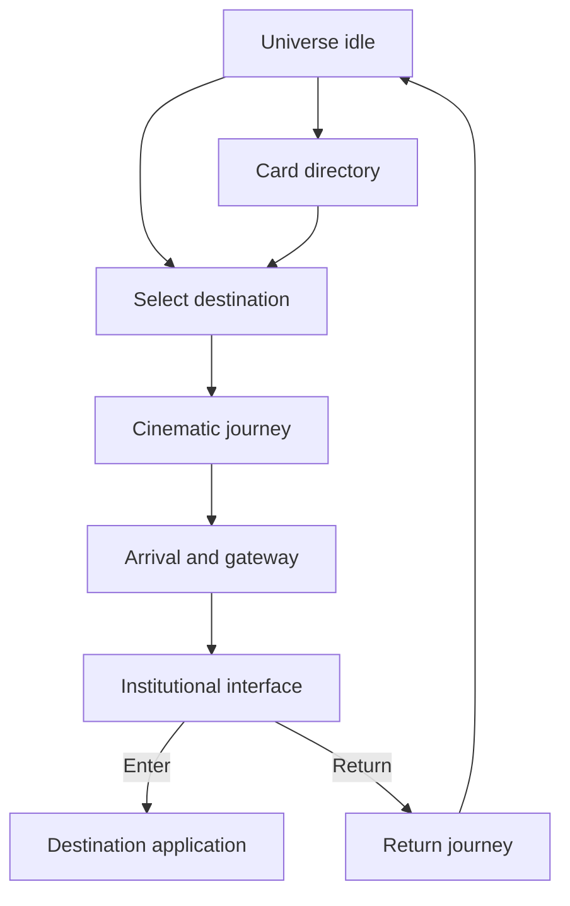

# Silicon Heartland Universe — Master Interaction and Camera Map V1

**Status:** Production authority  
**Version:** 1.0  
**Date:** August 1, 2026

## 1. Experience model

The landing page is a navigable universe, not a long scrolling website. The visitor begins in a calm master view, selects a destination, travels through a cinematic scene sequence, reaches one minimal institutional entry point, and can return to the same persistent universe state. A simple card-directory mode provides a fast alternative without replacing the journey.

## 2. Primary states

| State | Purpose | Allowed actions |
|---|---|---|
| `BOOT` | Load critical master-view assets and capability checks | Skip intro if returning visitor |
| `UNIVERSE_IDLE` | Main explorable universe | Select world, open card view, accessibility controls |
| `WORLD_FOCUS` | Confirm selected destination before departure | Continue journey, cancel |
| `JOURNEY` | Play destination-specific scene and camera sequence | Pause, skip to destination, return |
| `DESTINATION_ARRIVAL` | Establish destination identity | Continue to interface, return |
| `DESTINATION_INTERFACE` | Minimal institutional entry | Enter destination, return to universe |
| `CARD_DIRECTORY` | Accessible, fast destination selection | Open destination, resume universe |
| `RETURN_JOURNEY` | Restore universe without reload | Skip return |
| `REDUCED_MOTION` | Preserve hierarchy without simulated flight | Crossfade between approved keyframes |
| `ERROR_FALLBACK` | Keep navigation usable if 3D/media fails | Use static master image and cards |

## 3. Universe controls

- Planet/world selection: click, tap, keyboard focus + Enter/Space.
- Hover or focus: subtle outline, destination name, one-sentence role; no card explosion.
- Card view toggle: always available and remembered for the session.
- Sound: off by default; optional ambient sound requires explicit user action.
- Shooting star: ambient event approximately once per minute with randomized safe timing; never a required interaction.
- Stars: restrained asynchronous flicker; avoid uniform pulsing.
- Camera breathing: extremely subtle and disabled for reduced motion.
- Browser Back: returns one logical state at a time; it must never trap the user.
- Deep links: every destination interface has a stable URL and can load without replaying the full journey.

## 4. Canonical journey graph

## 5. Scene-to-state map

| Scenes | Destination | Functional phase | Camera behavior | End condition |
|---|---|---|---|---|
| 01–02 | Master universe | Arrival and universe interface | Slow reveal, settle into navigable orbital composition | `UNIVERSE_IDLE` |
| 03–08 | SHS BOS | Journey → arrival → gateway → interior → interface → return | Purposeful forward arc; controlled acceleration; interior deceleration; reverse return | Universe restored with AOS path available |
| 09–14 | AOS | Journey → arrival → gateway → interior → interface → return | Orbit emphasizes distinct ringed/agent-side identity; no BOS visual reuse | Universe restored with standards path available |
| 15–20 | Open Autonomous Standard | Journey → lunar arrival → geometric gateway → constitutional interior → interface → return | Straight, measured verification corridors and precise symmetry | Scene 20 returns to universe and reveals Registry route |
| 21–26 | Autonomous Registry | Journey → indexed arrival → archive gateway → Registry interior → interface → return | Concentric index bands align; provenance channels become disciplined paths | Scene 26 returns to universe and reveals Bureau route |
| 27–32 | Autonomous Trust Bureau | Journey → balanced arrival → evidence gateway → assessment interior → interface → final return | Bilateral movement around stable axis; measured approach; calm pullback | Scene 32 restores master universe loop |

## 6. Camera transition contract

### Universe to world focus

- Duration target: 900–1,400 ms.
- Use a slow ease-in-out; no snap zoom.
- Selected world increases in scale while neighboring objects retain parallax.
- Present destination identity only after focus stabilizes.
- Provide `CONTINUE JOURNEY` and quiet `CANCEL` when confirmation is necessary; a repeat-visitor preference may allow one-action departure.

### World focus to journey

- Duration target: 1,800–3,200 ms per major scene transition.
- Maintain one continuous travel axis even when using crossfaded still imagery.
- Use matched geometry, light direction, and focal center between consecutive scenes.
- Motion blur must be restrained and never destroy surface detail.

### Gateway entry

- Acceleration builds only after the destination fills the frame.
- Destination-specific geometry drives the passage: BOS pathways, AOS language, standards verification corridors, Registry archive lanes, Bureau bilateral evidence paths.
- Do not reuse one generic tunnel for multiple worlds.
- Decelerate before revealing an interior label.

### Interface reveal

- Architecture settles first; interface fades in second.
- Live controls must align with the approved composition but remain accessible DOM elements.
- Only one primary action is visible.
- Return control is visually quiet but keyboard and screen-reader discoverable.
- No auto-navigation into the destination application.

### Return to universe

- Preserve the identity of the world being left for at least the first third of the transition.
- Pull back along a related but not mechanically reversed camera path.
- Restore the same session universe orientation when practical.
- Focus transfers to the previously selected planet after return for keyboard continuity.

## 7. Destination interaction contracts

| Destination | Primary action | Return action | Status line | Independence rule |
|---|---|---|---|---|
| SHS BOS | Approved BOS entry label from bound scene | Return to Universe | Approved BOS status from bound scene | Business operating destination only |
| AOS | Approved AOS entry label from bound scene | Return to Universe | Approved AOS status from bound scene | Agent-side operating destination only |
| Open Autonomous Standard | `ENTER STANDARD` | `RETURN TO UNIVERSE` | `VERIFICATION ACTIVE · STANDARD ALIGNED` | Neutral standard; not owned by BOS or AOS |
| Autonomous Registry | `ENTER REGISTRY` | `RETURN TO UNIVERSE` | `REGISTRATION ACTIVE · PROVENANCE VERIFIED` | Independent Registry authority |
| Autonomous Trust Bureau | `ENTER BUREAU` | `RETURN TO UNIVERSE` | `ASSESSMENT ACTIVE · TRUST VERIFIED` | Independent Trust authority |

## 8. Card-directory mode

Card mode is a clean institutional directory, not the default visual identity.

- Show five destination cards maximum in the primary set.
- Each card contains destination name, one-sentence purpose, status, and one action.
- Maintain the same destination URLs and entry permissions as universe mode.
- Switching modes does not reset the selected destination.
- On small phones, card mode may be offered prominently, but the cinematic mode remains available.
- Cards never appear over the active cinematic scene as a wall of content.

## 9. Responsive behavior

| Capability | Desktop | Tablet | Mobile |
|---|---|---|---|
| Universe composition | Full parallax and pointer focus | Reduced parallax, touch targets enlarged | Art-directed framing; minimal parallax |
| Journey | Full approved timing | Slightly shortened | Shortened transitions with skip control always visible |
| Labels | Composition-aligned | Safe-area adjusted | Must pass phone-size legibility check |
| Card mode | Secondary toggle | Equal-priority alternative | Prominent alternative |
| Orientation | Landscape optimized | Both | Portrait first; landscape supported |

## 10. Accessibility and reduced motion

- Respect `prefers-reduced-motion` before any camera motion starts.
- Reduced motion uses short opacity dissolves between arrival, destination, and interface keyframes; no simulated forward flight, parallax, camera breathing, or shooting star.
- Every planet is a real focusable control with an accessible name and purpose.
- Provide visible focus, logical tab order, skip journey, pause motion, and return controls.
- Do not encode destination identity by shape or position alone.
- Maintain WCAG AA contrast for all live text and controls.
- Architectural text embedded in imagery must have equivalent accessible text in the DOM.
- Announce state changes politely; never narrate every animation frame.

## 11. Loading and performance behavior

- Initial load includes only Scene 01/02 assets, essential starfield, and the UI shell.
- Preload a destination's next two assets on hover, focus, or touch intent.
- Once a journey begins, prioritize its remaining assets; defer all other destination sequences.
- Display the current approved still if a later derivative is not ready; never replace it with a generic placeholder planet.
- Avoid blocking the main thread with continuous high-cost particle or blur effects.
- Target smooth interaction on modern mobile hardware; visual fidelity may scale down, identity may not.

## 12. URL and history model

Recommended routes:

| Experience | Route pattern |
|---|---|
| Universe | `/universe` |
| Card directory | `/universe/directory` |
| Destination focus | `/universe/:destination` |
| Destination interface | `/universe/:destination/enter` |

Valid destination slugs: `bos`, `aos`, `open-autonomous-standard`, `autonomous-registry`, `autonomous-trust-bureau`.

Journey progress itself should be session state, not dozens of URL entries. Browser history records meaningful navigation states only.

## 13. Analytics events

Track behavior without turning the experience into surveillance:

- `universe_viewed`
- `experience_mode_changed`
- `destination_focused`
- `journey_started`
- `journey_skipped`
- `journey_completed`
- `destination_entered`
- `returned_to_universe`
- `reduced_motion_applied`
- `asset_fallback_used`

Events should contain destination slug, experience mode, device class, reduced-motion state, and duration bucket—never unnecessary personal data.

## 14. Acceptance tests

1. Every destination can be reached by mouse, touch, and keyboard.
2. Every journey can be skipped and safely returned from.
3. Browser Back produces predictable state changes.
4. Direct destination URLs load without replaying the entire introduction.
5. Reduced-motion users experience no simulated flight.
6. Phone-size labels remain readable and controls remain reachable.
7. A missing derivative falls back to the approved source, never regenerated art.
8. Only the selected journey's assets receive high-priority loading.
9. The final return restores a usable universe, allowing another journey without reload.
10. BOS, AOS, Open Autonomous Standard, Autonomous Registry, and Autonomous Trust Bureau remain visually and architecturally distinct.

## 15. Implementation gate

Engineering may build the shell, routing, state machine, accessibility layer, and asset loader before file binding is complete. Final visual certification cannot pass until all 32 scene assets are `BOUND_AND_VERIFIED` in the asset manifest.
